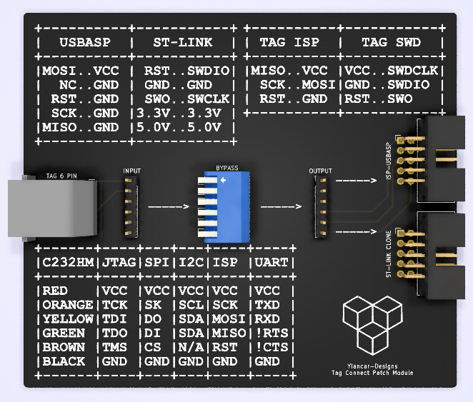

# TAG-Connect Adapter
 A simple routing PCB to connect a TAG-Connect cable to different programmers.

 This is designed to use a [TC2030-MCP-NL](http://www.tag-connect.com/TC2030-MCP-NL) cable and route it to:
 * Atmel ISP 10pin programmers such as [USBASP](https://hobbycomponents.com/usb-interface/841-usbasp-avr-programmer-adaptor)
 * [ST-LINK V2 clone programmer](https://www.amazon.co.uk/Youmile-Emulator-Downloader-Programmer-Programming/dp/B07QBLNDPM/ref=sr_1_1?keywords=stlink&qid=1578231027&sr=8-1). Please note that SWIM is at pin 5 and has been [modded](https://lujji.github.io/blog/stlink-clone-trace/) to be SWO.

 The BYPASS DIP switches can be used to disconnect a connection from the TAG cable to the programmer outputs. This way, the INPUT header can route the TAG cable to any device.

 
